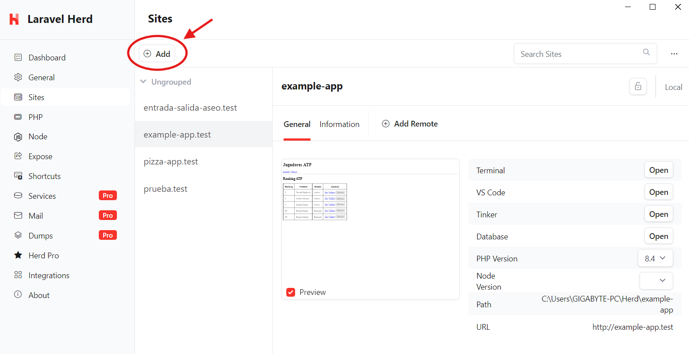
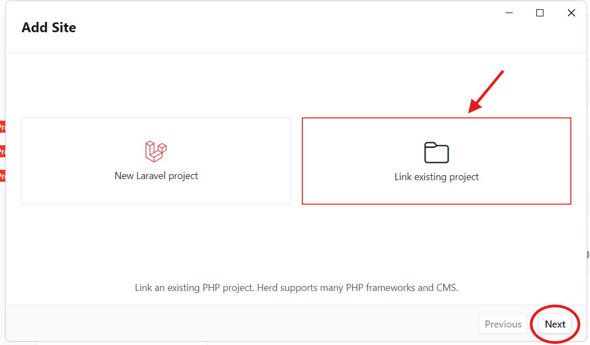
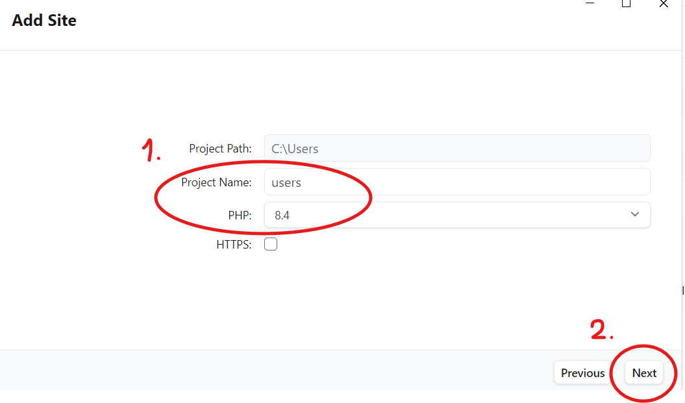
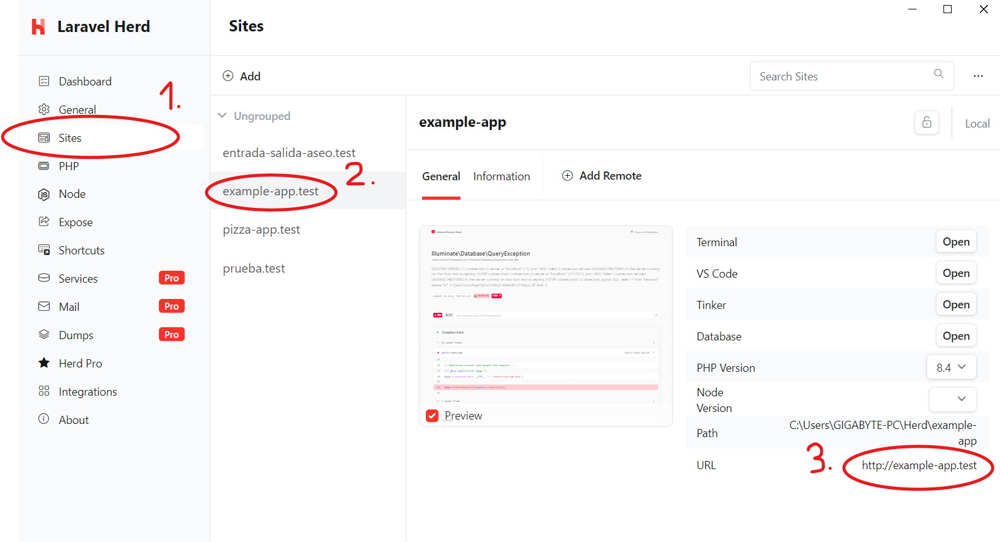
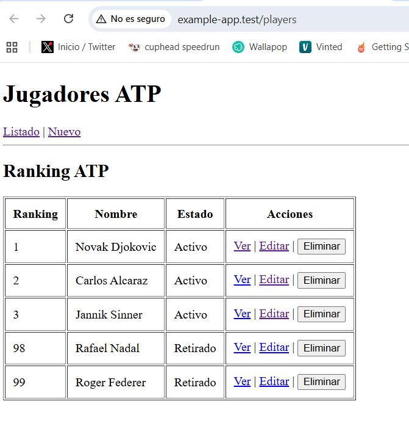

## FUNCIONAMIENTO EN ENTORNO LOCAL:

### Para ejecutar el proyecto utilizando Laravel Herd:

1. **Importar proyecto a Herd** Selecciona la opción para añadir un nuevo sitio.
   
   

2. **Seleccionar "Link existing project"** Busca la carpeta donde has clonado el repositorio.
   
   

3. **Configurar nombre y versión** Asigna el nombre al proyecto y asegúrate de usar **PHP 8.4**.
   
   

4. **Migraciones y Datos de prueba** Ejecuta el siguiente comando en tu terminal para crear las tablas y cargar los jugadores de ejemplo:
   
   ```bash
   php artisan migrate --seed

5. **Levantar docker-compose.local.yml** levantar el docker local para que carge el contenedor de postgres de la base de datos.

   ```bash
   docker compose -f docker-compose.local.yml up --build -d

  
6. **Acceso y Verificación Entramos a la URL** y el programa esta arrancado y funcionando.

  

  


### Para ejecutar el proyecto utilizando sin tener Laravel Herd:

1. **Migraciones y Datos de prueba** Ejecuta el siguiente comando en tu terminal para crear las tablas y cargar los jugadores de ejemplo:
   
   ```bash
   php artisan migrate --seed

2. **Levantamos el proyecto"** Ejecuta el siguiente comando en tu terminal para levantar el proyecto.

   ```bash
   php artisan serve

## FUNCIONAMIENTO EN ENTORNO DEV:

5. **Levantar docker-compose.dev.yml** levantar el docker dev para que carge el contenedor de postgres de la base de datos y laravel.

   ```bash
   docker compose -f docker-compose.dev.yml up --build -d

- Entrar a la ruta http://localhost:8080/players y deberia funcinar correctamnete

## RENDER
    - Enlace de render:
      - https://example-app-gsfk.onrender.com